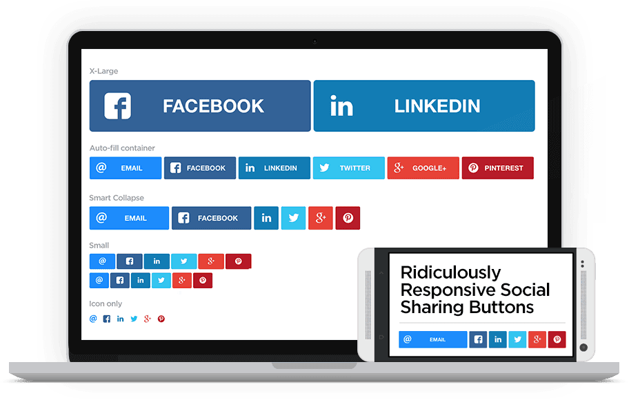
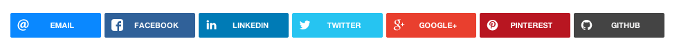

# Ridiculously Responsive Social Sharing Buttons

[](http://kurtnoble.com/labs/rrssb/) Love them or hate them, social sharing buttons appear to be with us for a while. It seemed like [**we**](http://www.kurtnoble.com) were constantly making custom buttons for every single project, so we decided to create a super flexible system that would work in any container.

RRSSB is built with [**SASS**](http://sass-lang.com/), so you can easily customize it by tweaking a few variables. SVGs allow for tiny file size and retina support. Add or remove icons as you see fit &mdash; the rest will fill in automagically in the container.



### Demo

> [**View the demo here**](http://kurtnoble.com/labs/rrssb/)

### Usage

1) Link to the css file in header:

```html
<link rel="stylesheet" href="css/rrssb.css" />
```


2) Copy `.rrssb-buttons` unordered list to desired location(s):

```html
<!-- Buttons start here. Copy this ul to your document. -->
<ul class="rrssb-buttons clearfix">
    <li class="rrssb-email">
        <a href="mailto:?subject=Check%20out%20how%20ridiculously%20responsive%20these%20social%20buttons%20are&amp;body=http%3A%2F%2Fkurtnoble.com%2Flabs%2Frrssb%2Findex.html">
            <span class="rrssb-icon">
                <svg xmlns="http://www.w3.org/2000/svg" xmlns:xlink="http://www.w3.org/1999/xlink" version="1.1" x="0px" y="0px" width="28px" height="28px" viewBox="0 0 28 28" enable-background="new 0 0 28 28" xml:space="preserve"><g><path d="M20.111 26.147c-2.336 1.051-4.361 1.401-7.125 1.401c-6.462 0-12.146-4.633-12.146-12.265 c0-7.94 5.762-14.833 14.561-14.833c6.853 0 11.8 4.7 11.8 11.252c0 5.684-3.194 9.265-7.399 9.3 c-1.829 0-3.153-0.934-3.347-2.997h-0.077c-1.208 1.986-2.96 2.997-5.023 2.997c-2.532 0-4.361-1.868-4.361-5.062 c0-4.749 3.504-9.071 9.111-9.071c1.713 0 3.7 0.4 4.6 0.973l-1.169 7.203c-0.388 2.298-0.116 3.3 1 3.4 c1.673 0 3.773-2.102 3.773-6.58c0-5.061-3.27-8.994-9.303-8.994c-5.957 0-11.175 4.673-11.175 12.1 c0 6.5 4.2 10.2 10 10.201c1.986 0 4.089-0.43 5.646-1.245L20.111 26.147z M16.646 10.1 c-0.311-0.078-0.701-0.155-1.207-0.155c-2.571 0-4.595 2.53-4.595 5.529c0 1.5 0.7 2.4 1.9 2.4 c1.441 0 2.959-1.828 3.311-4.087L16.646 10.068z"/></g></svg>
            </span>
            <span class="rrssb-text">email</span>
        </a>
    </li>
    <li class="rrssb-facebook">
        <a href="https://www.facebook.com/sharer/sharer.php?u=http://kurtnoble.com/labs/rrssb/index.html" class="popup">
            <span class="rrssb-icon">
                <svg version="1.1" id="Layer_1" xmlns="http://www.w3.org/2000/svg" xmlns:xlink="http://www.w3.org/1999/xlink" x="0px" y="0px" width="28px" height="28px" viewBox="0 0 28 28" enable-background="new 0 0 28 28" xml:space="preserve">
                    <path d="M27.825,4.783c0-2.427-2.182-4.608-4.608-4.608H4.783c-2.422,0-4.608,2.182-4.608,4.608v18.434
                        c0,2.427,2.181,4.608,4.608,4.608H14V17.379h-3.379v-4.608H14v-1.795c0-3.089,2.335-5.885,5.192-5.885h3.718v4.608h-3.726
                        c-0.408,0-0.884,0.492-0.884,1.236v1.836h4.609v4.608h-4.609v10.446h4.916c2.422,0,4.608-2.188,4.608-4.608V4.783z"/>
                </svg>
            </span>
            <span class="rrssb-text">facebook</span>
        </a>
    </li>
    <li class="rrssb-twitter">
        <a href="http://twitter.com/home?status=Ridiculously%20Responsive%20Social%20Sharing%20Buttons%20by%20@seagoat%20and%20@dbox%20http://kurtnoble.com/labs/rrssb" class="popup">
            <span class="rrssb-icon">
                <svg version="1.1" id="Layer_1" xmlns="http://www.w3.org/2000/svg" xmlns:xlink="http://www.w3.org/1999/xlink" x="0px" y="0px"
                     width="28px" height="28px" viewBox="0 0 28 28" enable-background="new 0 0 28 28" xml:space="preserve">
                <path d="M24.253,8.756C24.689,17.08,18.297,24.182,9.97,24.62c-3.122,0.162-6.219-0.646-8.861-2.32
                    c2.703,0.179,5.376-0.648,7.508-2.321c-2.072-0.247-3.818-1.661-4.489-3.638c0.801,0.128,1.62,0.076,2.399-0.155
                    C4.045,15.72,2.215,13.6,2.115,11.077c0.688,0.275,1.426,0.407,2.168,0.386c-2.135-1.65-2.729-4.621-1.394-6.965
                    C5.575,7.816,9.54,9.84,13.803,10.071c-0.842-2.739,0.694-5.64,3.434-6.482c2.018-0.623,4.212,0.044,5.546,1.683
                    c1.186-0.213,2.318-0.662,3.329-1.317c-0.385,1.256-1.247,2.312-2.399,2.942c1.048-0.106,2.069-0.394,3.019-0.851
                    C26.275,7.229,25.39,8.196,24.253,8.756z"/>
                </svg>
           	</span>
            <span class="rrssb-text">twitter</span>
        </a>
    </li>
</ul>
<!-- Buttons end here -->
```


- Only copy the `li`s of the buttons you want (index.html has examples of all available types).

- Adding a class of `popup` to the anchor tag for each share button will make the share dialog open in a popup, rather than a new window. (Good for Facebook, Twitter, Google Plus, etc.)
- Buttons will automatically flow to the size of the ul `rrssb-buttons`. If specifically sized buttons are needed, nest `rrssb-buttons` in a fixed-width container.
- Each sharing URL requires various parameters that allow you to pass through messaging in the sharing dialog. A useful tool for URI escaping any messaging that needs to pass through the share URL can be found [**here**](http://meyerweb.com/eric/tools/dencoder/).


3) Link to javascript files at the bottom of your document before the closing body tag for best results. (jQuery CDN, [**jQuery fallback**](http://css-tricks.com/snippets/jquery/fallback-for-cdn-hosted-jquery/), and `rrssb.min.js`):

```html
<script src="http://ajax.googleapis.com/ajax/libs/jquery/1.10.2/jquery.min.js"></script>
<script>window.jQuery || document.write('<script src="js/vendor/jquery.1.10.2.min.js"><\/script>')</script>
<script src="js/rrssb.min.js"></script>
```


#### Other install options:

| Service							| Link |
| :---------------------------------	| :------- |
| [**Bower**](http://bower.io)	| `bower search rrssb` |
| Rails * 							| [**Rails Setup by @rimkashox**](http://www.simplehacks.com/web-dev/how-to-use-rrssb-with-rails/) |
| Wordpress * 						| [**Wordpress plugin by @aarreedd**](http://wordpress.org/plugins/ridiculously-responsive-social-sharing-buttons/) |
| Drupal *							| [**Drupal Install Instructions**](https://drupal.org/project/rrssb) |
| CDN * 								| [**OSSCDN by MaxCDN**](http://osscdn.com/#/rrssb) |

<small>* Managed by 3rd parties. Please contact project hosts for support.</small>

### Support

Currently tested between [**140px**](https://www.dropbox.com/s/2k6lcebg2887ge3/Screenshot%202014-02-18%2009.45.45.png) and [**15,465px**](https://www.dropbox.com/s/1juq03011lixk3r/Screenshot%202014-02-18%2009.43.57.png) on current versions of Chrome 33, Safari 7.0.2, Firefox 27, Opera 20, and IE9+.

Requires [**calc**](http://caniuse.com/calc) and [**SVG**](http://caniuse.com/svg)


### Version Notes

1.6.5 - Namespace CSS classes [(#42)](https://github.com/kni-labs/rrssb/issues/42) - Legacy HTML will be incompatible until class names updated.

### About

RRSSB is a [**KNI Labs freebie**](http://kurtnoble.com/) crafted by [**@dbox**](http://www.twitter.com/dbox) and [**@joshuatuscan**](http://www.twitter.com/joshuatuscan).

This content is released under the [**Creative Commons Attribution-ShareAlike 4.0 International**](http://creativecommons.org/licenses/by-sa/4.0/legalcode) license.
